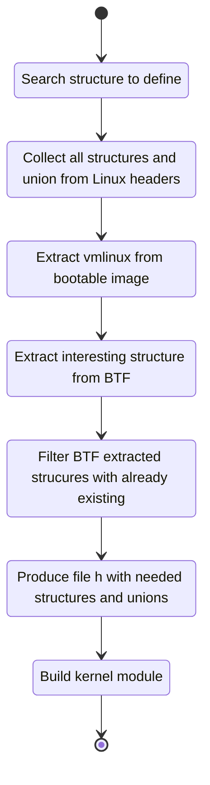

# Out-of-Tree Kernel Modules with BTF PoC

## Overview

This repository contains a PoC demonstrating a method to write Out-of-Tree 
kernel modules that leverage private header struct definitions using BTF. 
The PoC explores a hack that enables the usage of non-public header struct 
definitions in OoT modules.

## Motivation

In certain scenarios, OoT kernel modules may require access to private header
struct definitions, which are not directly available in public headers. 
Traditional methods of accessing private headers can lead to complications 
and maintenance challenges. 
This PoC explores an alternative approach utilizing BTF, a feature that 
provides rich type information for BPF programs.

## How it Works

The PoC demonstrates how a basic kernel module that uses a private struct
can import and use the struct without having the structure declaration and
importing it directly from the kernel image. 
The process involves:

1. Customied Makefile that runs scripts that prepare the environment
2. Module sourcecode that marks with `//BTF_INCLUDE` the structures that 
   are needed to be imported 
3. a cripts that prepares a consistency of all the already existing structure 
   declared in public headers.
4. A script that handles dependencies and recursively extracts any 
   related structures without redeclaring already existing structures.

## Note of Caution

While the PoC showcases a functional solution for the specific use case 
presented as demo, it is essential to exercise caution when applying this 
approach in production environments. 
Consider the implications of using non-public header struct definitions and
thoroughly review any potential risks or conflicts.

## Getting Started

To explore the PoC, follow the steps below:
1. Clone this repository to your local machine.
2. Run `make` 
3. Enjoy the module that builds using private structure definition

